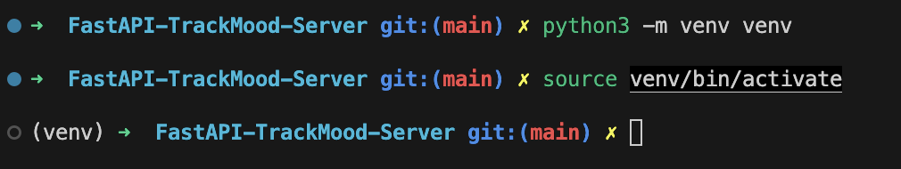
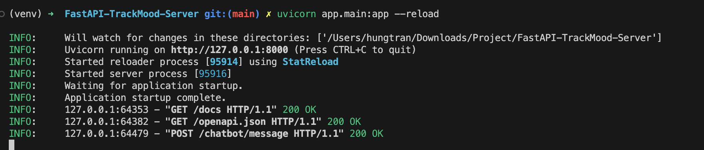
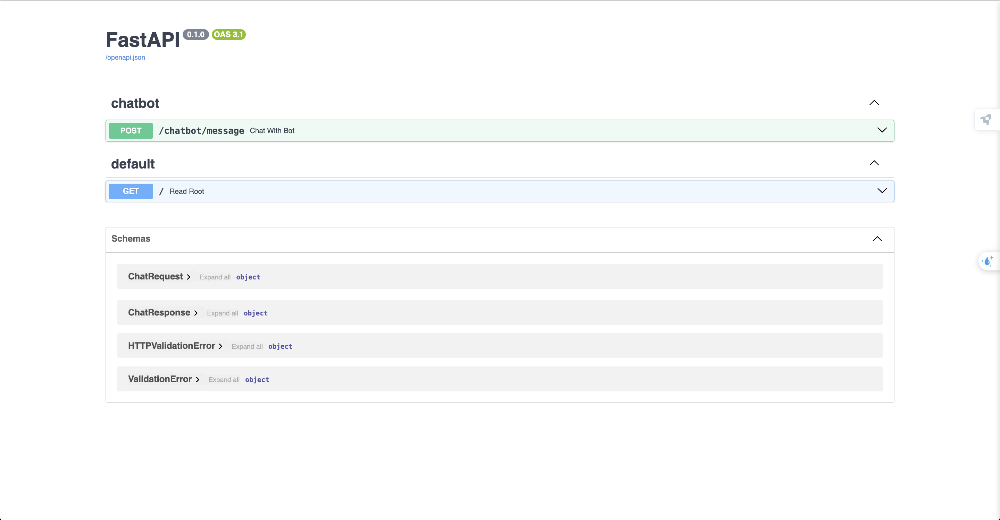

# YourCare (TrackMood-Server) By Khanh Hung

### Step to set-up:
Step 1: Create venv
```
python3 -m venv venv
```
Step 2: Activate venv
On Windows:
```
venv\Scripts\activate
```
On MacOS/Linux:
```
source venv/bin/activate
```
As the picture:


Step 3: Create .env file:
with content:
```
take from Khanh Hung
```
Step 4: Install packages/dependencies
Install FastAPI and Uvicorn (for running server)
```
pip install fastapi uvicorn requests
```

Step 5: Save the libraries into file requirements.txt
```
pip freeze > requirements.txt
```
It will have a file requirements.txt in the source code outside the app.

## Running APP FAST-API
Run server backend by:
```
uvicorn app.main:app --reload
```
Sample Result with: 


## Stop Server and venv when not in use:
```
deactivate
```
## Documents:

#### Link Swagger when run local: http://127.0.0.1:8000/docs 
You will see like:

